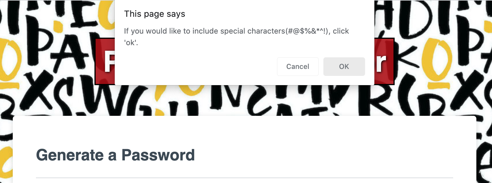
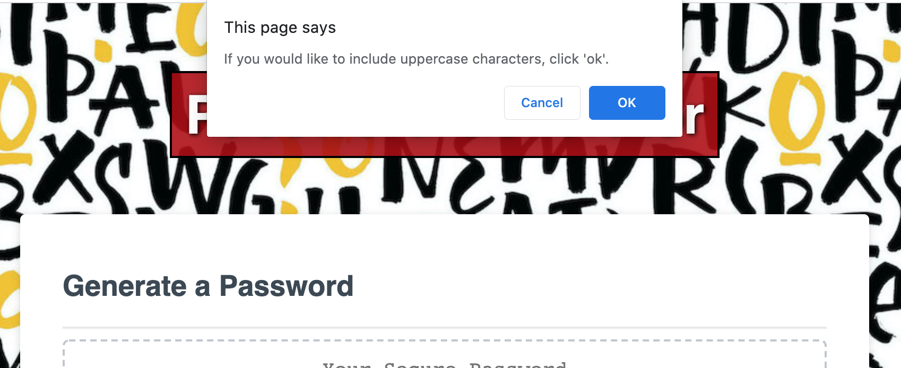

# Password.Generator

## Descritpion
For this exercise I created an application that generates a unique password based on the User requested specifications.  The User has the option to include special characters, numeric characters, lowercase characters and/or uppercase characters.  After criteria is satisfied, the Password Generator provides the User with a randomly generated password.  Technologies used include HTML, CSS, JavaScript, Bootstrap and Google Fonts.  

## Installation

Password Generator can be accessed [here.](https://lee-amber-alex.github.io/Password.Generator/)  
Project Repository can be accessed [here.](https://github.com/lee-amber-alex/Password.Generator)

## Usage 

### Welcome page.  

  

### Welcome page with character length assigment prompt.  

  

###  Special Character prompt.

  

### Numeric Character prompt.  

   

### Lowercase Character prompt.  

  

### Uppercase Character prompt.  

  

### Unique Generated Password.   

  

### Contact Me  
 
Amber Alex Lee
- [Email](lee.amber.alex@gmail.com)
- [Github Page](https://github.com/lee-amber-alex)
- [LinkedIn](www.linkedin.com/in/leeamberalex)

